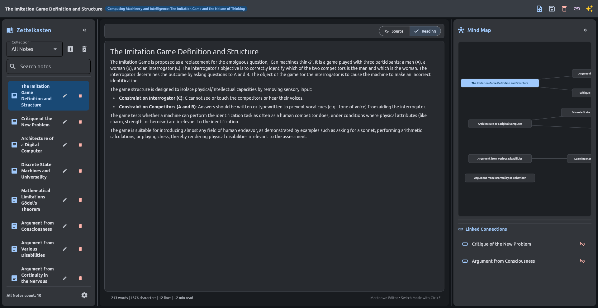

# Zettelkasten AI Notes

[](https://www.python.org/)
[](https://flet.dev/)
[](https://www.sqlite.org/)
[](https://www.vulkan.org/)
[](LICENSE)

A powerful, privacy-first desktop knowledge management system implementing the **Zettelkasten** methodology. Built with **Python 3.13** and **Flet** (Flutter-backed desktop UI), it features advanced Markdown editing with live preview, an interactive Canvas Mind Map, local SQLite storage with WAL mode, and a **Dual AI Engine** that extracts structured atomic notes and semantic graph connections from PDF documents using either **Google Gemini API** or **offline local GGUF models** with hardware-accelerated Vulkan compute.

---

## 📸 Screenshots



---

## 🌟 Key Features

### 🧠 Dual AI Note Extraction Engine
* **Cloud AI (Google Gemini)**: Fast, high-throughput extraction using the official `google-genai` SDK (v2.22.0).
* **Offline Local AI (GGUF via Vulkan)**: 100% offline, privacy-first local inference powered by `llama-cpp-python` with cross-vendor **Vulkan GPU acceleration** (AMD, NVIDIA, Intel, Apple Silicon).
* **Process-Isolated Execution**: Local inference runs inside an isolated `multiprocessing` worker. This prevents GUI thread deadlocks with Wayland/Vulkan presentation hooks, ensures a 100% responsive UI during heavy computation, and guarantees immediate RAM/VRAM reclamation upon completion or cancellation.
* **Intelligent Response Parsing (`AiResponseParser`)**: Robust multi-strategy JSON extraction that sanitizes connections, cleans citations (`[1]`, `[Smith et al.]`), ignores structural markers (Figure, Table, Section, Clause), and repairs malformed LLM responses.

### 📦 In-App Model Manager & Downloader
* **Curated Model Catalog (`local_models_catalog.py`)**:
  * **Gemma 4 (E2B)** *(3.2 GB)*: Lightweight & ultra-fast with a 128K context window. Suitable for any desktop or laptop.
  * **Gemma 4 (12B)** *(6.2 GB)*: Balanced, deep conceptual analysis for academic papers, theses, and technical books.
  * **Gemma 4 (26B MoE)** *(13.1 GB)*: Flagship Mixture-of-Experts architecture for deep synthesis across multidisciplinary domains.
* **Built-in Chunked HTTP Downloader (`model_downloader.py`)**: Download models directly from Hugging Face within the UI with live progress indicators, speed calculation, ETA estimation, cancellation, and local storage management.

### 🛡️ Hardware Resource Inspector & OOM Guard (`hardware_checker.py`)
* Automatically detects host system RAM, CPU cores, GPU devices, and available VRAM.
* Validates system capacity before downloading or running models to prevent Out-Of-Memory (OOM) crashes.
* Dynamically calculates optimal GPU offloading layers (`n_gpu_layers`) for hardware acceleration.

### ✍️ Advanced Live Markdown Workspace (`markdown_editor_widget.py`)
* **Dual Modes (Source & Reading)**: Seamlessly toggle between raw editing and rendered preview with `Ctrl+E` or the header toggle.
* **Comprehensive Formatting Toolbar**:
  * Headings (H1–H4), Bold (`Ctrl+B`), Italic (`Ctrl+I`), Strikethrough, Inline Code, and Syntax-Highlighted Code Blocks.
  * Blockquotes, Bullet Lists, Numbered Lists, Task Checkboxes (`- [ ]`), Web Links, Table Templates, and Horizontal Rules.
* **Interactive Task Checklists**: Toggle `- [ ]` and `- [x]` directly in both Source and Reading modes with interactive click handling.
* **LaTeX Math Normalization**: Full inline math (`$ ... $`, `\( ... \)`) and display math (`$$ ... $$`, `\[ ... \]`) rendered via Flutter KaTeX without corrupting standard markdown code blocks.
* **Document Telemetry & Statistics**: Real-time word count, character count, line count, and estimated reading time.
* **Debounced Auto-Save**: Non-blocking asynchronous auto-save with a dirty state indicator (`*`) and unsaved change protection guards.

### 🔗 Smart Bidirectional Linking & [[WikiLink]] System
* **Obsidian-Compatible WikiLinks**: Link ideas using `[[Target Note]]` or `[[Target Note|Custom Alias]]`.
* **Interactive Navigation & Auto-Creation**: Click a wikilink to immediately open the target note. If the note does not exist yet, the app prompts you to create and link it in a single click.
* **Quick Link Picker (`Ctrl+K`)**: Live search modal to effortlessly create directional and bidirectional links between notes.
* **Strict Semantic Edge Resolution**: Prevents false graph connections and hallucinated links by matching exact titles and normalized case-folded names.

### 🗺️ Interactive Canvas Mind Map & Knowledge Graph (`mind_map_widget.py`)
* Dynamically renders your knowledge graph on a hardware-accelerated `flet.canvas` with automatic layout positioning via `PyGraphviz`.
* Fluid **Pan & Zoom** powered by `InteractiveViewer`.
* Click any node in the graph to jump directly to that note in the editor workspace.
* Resizable layout with vertical splitters between the mind map and the linked notes panel.

### 🖥️ Modular 3-Pane Responsive Layout (`ui/`)
* **Left Sidebar**: Collection filter dropdown, real-time search input, note list, item counts, and settings launcher.
* **Center Workspace**: Live Markdown editor, mode toggle, and action buttons.
* **Right Panel**: Interactive Mind Map canvas and Linked Notes relationship inspector.
* **Collapsible Narrow Rails**: Minimize the left sidebar (`Ctrl+[`) or right panel (`Ctrl+]`) into compact 50px icon rails to maximize writing area.
* **Draggable Splitters**: Drag vertical and horizontal splitter handles to customize pane proportions.

### 💾 Robust SQLite Persistence (`database_manager.py`)
* Local storage in `db/notes.db` configured with **Write-Ahead Logging (WAL)** mode for fast, non-blocking concurrent reads and writes.
* Thread-safe access via thread-local connections (`DatabaseManager._local.conn`).
* Enforced foreign key integrity (`PRAGMA foreign_keys = ON`) with cascading deletes.

---

## 🏛️ Architecture Overview

The codebase is designed with clean architecture and SOLID principles, strictly decoupling domain logic from UI presentation:

```
                               ┌────────────────────────┐
                               │        main.py         │
                               │(Application Entrypoint)│
                               └───────────┬────────────┘
                                           │
                               ┌───────────▼────────────┐
                               │     AppController      │ ◄──── AppState (Reactive State)
                               └─────┬──────────────┬───┘
                                     │              │
             ┌───────────────────────┘              └────────────────────────┐
             ▼                                                               ▼
   ┌────────────────────┐                                         ┌─────────────────────┐
   │    Modular UI      │                                         │  Domain & Services  │
   ├────────────────────┤                                         ├─────────────────────┤
   │ SidebarView        │                                         │ NoteService         │
   │ EditorWorkspaceView│                                         │ DatabaseManager     │
   │ RightPanelView     │                                         │ HardwareChecker     │
   │ DialogManager      │                                         │ ModelDownloader     │
   │ Splitters          │                                         │ PdfProcessor        │
   └────────────────────┘                                         └──────────┬──────────┘
                                                                             │
                                                               ┌─────────────▼────────────┐
                                                               │  BaseAiProvider Factory  │
                                                               ├─────────────┬────────────┤
                                                               │             │            │
                                                               ▼             ▼            ▼
                                                          GeminiClient  LocalGgufClient  Parser
                                                          (Cloud SDK)   (Vulkan / GGUF)  (Sanitizer)
```

---

## 💻 Hardware Requirements for Local AI

| Model Tier | Model Name | Recommended RAM | VRAM (for Full GPU Offload) | Context Window |
| :--- | :--- | :--- | :--- | :--- |
| **Lightweight** | Gemma 4 (E2B) | 8 GB | 4 GB | 128K tokens |
| **Balanced** | Gemma 4 (12B) | 16 GB | 8–10 GB | 128K tokens |
| **Flagship** | Gemma 4 (26B MoE) | 32 GB | 16+ GB | 128K tokens |

> **Note:** If you do not have a dedicated GPU, models will automatically offload to CPU RAM using multi-threaded CPU inference. Cloud AI (Google Gemini) has no local hardware requirements.

---

## ⌨️ Keyboard Shortcuts

| Shortcut | Action | Scope |
| :--- | :--- | :--- |
| `Ctrl + S` | Save current note | Global |
| `Ctrl + N` | Create a new note | Global |
| `Ctrl + E` | Toggle Editor Mode (Source ⇄ Reading) | Global |
| `Ctrl + B` | Format selected text as **Bold** | Editor |
| `Ctrl + I` | Format selected text as *Italic* | Editor |
| `Ctrl + K` | Open WikiLink picker dialog | Global |
| `Ctrl + [` | Collapse / Expand Left Sidebar | Global |
| `Ctrl + ]` | Collapse / Expand Right Mind Map Panel | Global |

---

## 🚀 Installation & Setup

### Prerequisites
* **Python 3.13** (Recommended)
* **Vulkan Drivers**: For local GPU acceleration:
  * **Linux**: `vulkan-tools`, `mesa-vulkan-drivers` (or proprietary NVIDIA/AMD Vulkan drivers).
  * **Windows**: Latest NVIDIA / AMD / Intel graphics drivers with Vulkan runtime support.

### 1. Clone the Repository
```bash
git clone https://github.com/your-username/Zettelkasten-AI-Notes.git
cd Zettelkasten-AI-Notes
```

### 2. Set Up Virtual Environment
```bash
python3.13 -m venv .venv

# On Linux / macOS:
source .venv/bin/activate

# On Windows:
.venv\Scripts\activate
```

### 3. Install Dependencies
```bash
pip install -r requirements.txt
```
*(Note: `requirements.txt` includes the Vulkan wheel index for `llama-cpp-python`)*.

### 4. Configuration

#### Option A: Using Google Gemini (Cloud AI)
1. Obtain an API key from [Google AI Studio](https://aistudio.google.com/).
2. Create a `.env` file in the project root:
   ```env
   GEMINI_API_KEY="your_api_key_here"
   ```
   *(Alternatively, configure the key in the in-app Settings dialog).*

#### Option B: Using Local GGUF Models (Offline AI)
1. Launch the application.
2. Set AI Provider to **Local GGUF**.
3. Navigate to **Settings (`⚙️`) -> Local Model Manager**.
4. Choose a model tier (e.g., **Gemma 4 E2B**) and click **Download**.
5. Select the downloaded model as your active local model. 

### 5. Run the Application
```bash
# Using the dedicated virtualenv:
./.venv/bin/python src/main.py

# Or via Flet CLI inside the activated venv:
flet run src/main.py
```

---

## 📁 Project Structure

```
Zettelkasten-AI-Notes/
├── src/
│   ├── ui/                         # Modular UI presentation layer
│   │   ├── __init__.py             # Exports for UI components
│   │   ├── dialog_manager.py       # Modal dialogs (Settings, Downloader, Confirmations)
│   │   ├── editor_workspace.py     # Center editor workspace and quick actions
│   │   ├── right_panel_view.py     # Mind Map canvas and linked notes list panel
│   │   ├── sidebar_view.py         # Collection navigation, search, and note list
│   │   └── splitters.py            # Draggable responsive splitter handles
│   ├── ai_note_generator_worker.py # Background thread & isolated multiprocessing worker
│   ├── ai_provider.py              # BaseAiProvider abstract interface & provider factory
│   ├── ai_response_parser.py       # Multi-strategy JSON response parser & graph sanitizer
│   ├── app_controller.py           # Application controller orchestrating actions & events
│   ├── app_state.py                # Reactive state container (dirty state, filters, notes)
│   ├── database_manager.py         # Thread-safe SQLite repository (WAL mode, FKs, migrations)
│   ├── env_config.py               # Headless Vulkan & desktop environment initialization
│   ├── gemini_api_client.py        # Google Gemini API client (google-genai SDK v2.22.0)
│   ├── hardware_checker.py         # RAM/VRAM/GPU detection and safe execution boundaries
│   ├── local_gguf_client.py        # llama-cpp-python offline inference engine
│   ├── local_models_catalog.py     # Curated local models catalog (Gemma 4 family)
│   ├── logger.py                   # Centralized rotating file and console logger
│   ├── main.py                     # Application entry point & responsive 3-pane assembly
│   ├── markdown_editor_widget.py   # Markdown editor with Source & Reading modes
│   ├── mind_map_widget.py          # Interactive canvas knowledge graph visualization
│   ├── model_downloader.py         # Chunked HTTP model downloader with progress reporting
│   ├── models.py                   # Domain dataclasses (Note, NoteMetadata, NoteLink)
│   ├── note_manager.py             # Backward-compatible note manager adapter
│   ├── note_service.py             # Core business logic (CRUD, sanitization, LaTeX, wikilinks)
│   ├── pdf_processor.py            # PDF text extraction and document chunking
│   └── prompt_templates.py         # Structured Zettelkasten extraction prompt templates
├── tests/                          # Automated pytest suite (181 tests across 16 files)
│   ├── test_ai_provider.py
│   ├── test_ai_response_parser.py
│   ├── test_ai_worker_and_pdf.py
│   ├── test_app_controller.py
│   ├── test_database_manager.py
│   ├── test_gemini_api_client.py
│   ├── test_hardware_checker.py
│   ├── test_local_gguf_client.py
│   ├── test_local_models_catalog.py
│   ├── test_logger.py
│   ├── test_markdown_editor.py
│   ├── test_mind_map_widget.py
│   ├── test_model_downloader.py
│   ├── test_models_and_service.py
│   ├── test_note_manager.py
│   └── test_ui_components.py
├── requirements.txt                # Project dependencies
├── LICENSE                         # GNU General Public License v3.0
└── README.md                       # Project documentation
```

---

## 🧪 Testing & Verification

The project includes an extensive automated test suite covering domain logic, UI view controls, AI parsers, SQLite transactions, and hardware detection:

```bash
# Run the entire test suite (181 tests):
./.venv/bin/pytest

# Run tests with verbose output:
./.venv/bin/pytest -v

# Run a specific test suite:
./.venv/bin/pytest tests/test_markdown_editor.py
```

All **181 tests** execute and pass in ~1.6 seconds.

---

## 🤝 Contributing

Contributions, feature requests, and bug reports are warmly welcome!
1. Fork the Project
2. Create your Feature Branch (`git checkout -b feature/AmazingFeature`)
3. Commit your Changes (`git commit -m 'feat: Add AmazingFeature'`)
4. Ensure all tests pass (`./.venv/bin/pytest`)
5. Push to the Branch (`git push origin feature/AmazingFeature`)
6. Open a Pull Request

---

## 📄 License

Distributed under the **GNU General Public License v3.0 (GPLv3)**. See [`LICENSE`](LICENSE) for more information.